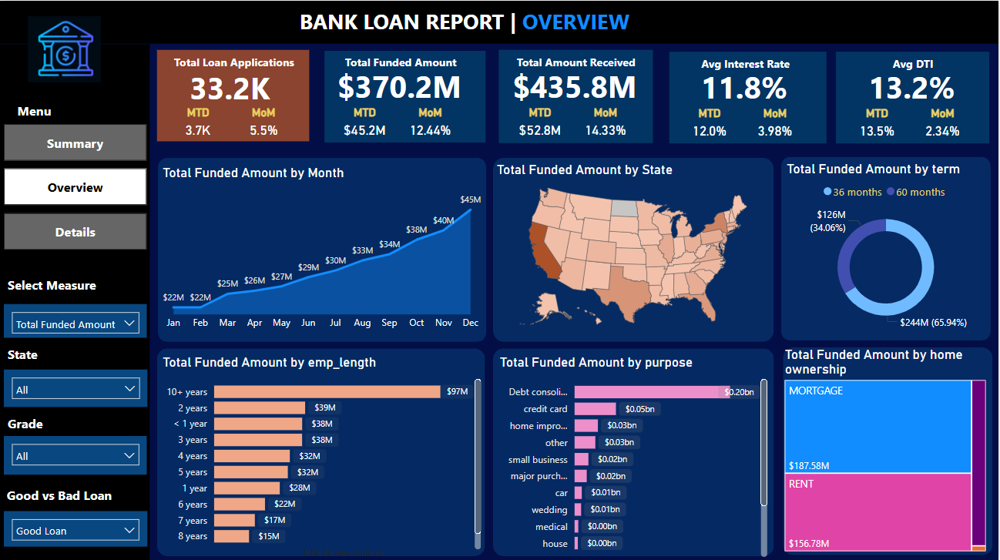

# Bank Loan Data Analysis Project

## 1. Objective
The objective of this project is to analyze bank loan data, extract key insights, and present them using a Power BI dashboard. The analysis focuses on loan applications, funded amounts, payment records, interest rates, DTI (Debt-to-Income Ratio), and loan statuses. The final goal is to create a 3-page Power BI dashboard that summarizes the key findings and allows for detailed exploration of the data.

## 2. Dataset
The dataset used for this analysis is detailed in the following document:

[Dataset Details](Dataset/Dataset_details.md)

This dataset contains information about various loan applications, including personal details, loan amount, payment history, loan status, and more.

## 3. Problem Statement
The problem statement for this project, including the requirements and business logic, can be found in this document:

[Problem Statement & Other Details](Problem_Statement_&_other_details.md)

This document outlines the main objectives of the analysis and the specific key performance indicators (KPIs) to track.

## 4. Workflow Summary
The project workflow followed these steps:

1. **Dataset Collection and Problem Understanding**: 
   - Collected the dataset and thoroughly understood the problem statement and requirements.

2. **Data Querying Using MS SQL Server**:
   - Used SQL queries in MS SQL Server to extract key performance indicators (KPIs) and other relevant data.
   - All SQL queries used in this project are available in the following files:
     - [SQL Queries MD file](SQL_queries.md)
     - [SQL Queries Document (Word)](SQL_work/SQL_Query_Doc.docx)
     - [SQL Queries Script (SQL File)](SQL_work/SQL_Queries.sql)
   
3. **Power BI Dashboard Creation**:
   - Cleaned and transformed the data by connecting to the MS SQL Server.
   - Created a 3-page navigated Power BI dashboard to visualize and present the KPIs.
   - The 3-page dashboard includes:
     - 
     - 
     - 

4. **Dashboard Interactivity Recording**:
   - Recorded the interactive features of the Power BI dashboard.
   - The recorded demo video can be found here: 
     - 

## 5. Key Insights:
### Key Performance Indicators (KPIs) Summary: ✅ Overall Loan Performance

| Metric                        | Value    | MTD Value | MoM Change       |
|-------------------------------|----------|-----------|------------------|
| Total Loan Applications        | 38.6K    | 4.3K      | 13.04% Increase  |
| Total Funded Amount            | $435.8M  | $54.0M    | 15.84% Increase  |
| Total Amount Received          | $473.1M  | $58.1M    | 15.84% Increase  |
| Average Interest Rate          | 12%      | 12.4%     | 3.47% Increase   |
| Average Debt-to-Income (DTI)   | 13.3%    | 13.7%     | 2.73% Increase   |

----------------------------------------------------------------------------

### 2. Loan Quality & Risk Segmentation: 🟢 Good Loans (Low Risk) vs 🔴 Bad Loans (High Risk):
| Loan Category         | Good Loans (Low Risk)          | Bad Loans (High Risk)           |
|-----------------------|--------------------------------|---------------------------------|
| **Percentage of Applications** | 86.2% (33.2K out of 38.6K) | 13.8% (5.3K)                   |
| **Funded Amount**     | $370M                          | $65.5M                          |
| **Amount Received**   | $435.8M                        | $37.3M                          |
| **Recovery Rate**     | -                              | Approx. 57% (Significant losses on defaulted loans) |
----------------------------------------------------------------------------------------------------------------

### 3. Loan Status Breakdown: ✅ Fully Paid Loans vs ❌ Charged-Off Loans vs 🔄 Current Loans (Active):
| Loan Status           | Fully Paid Loans              | Charged-Off Loans             | Current Loans (Active)       |
|-----------------------|-------------------------------|--------------------------------|------------------------------|
| **Applications**      | 32,145                        | 5,333                          | 1,098                        |
| **Funded Amount**     | $351.4M                       | $65.3M                         | $18.9M                       |
| **Amount Received**   | $411.6M                       | $37.3M                         | $24.2M                       |
| **MTD Funded Amount** | $41.3M                        | $8.7M                          | $3.9M                        |
| **MTD Amount Received**| $47.8M                        | $5.3M                          | $4.9M                        |
| **Average Interest Rate** | 11.64%                    | 13.88%                         | 15.10%                       |
| **Average DTI**       | 13.17%                        | 14.00%                         | 14.72%                       |
----------------------------------------------------------------------------------------------------------------

### 4. Key Findings & Segment-Wise Analysis:
| **Category**                      | **Details**                                                                                                                                                  | **Recommendations**                                                                                                                                                                                                                           |
|------------------------------------|--------------------------------------------------------------------------------------------------------------------------------------------------------------|----------------------------------------------------------------------------------------------------------------------------------------------------------------------------------------------------------------------------------------------|
| **1. Loan Purpose Analysis**       | Top Loan Purpose: ✅ Debt Consolidation → 18.2K Applications (~47%)   Other Major Loan Purposes: Home Improvement, Small Business, Credit Card Payoff   Least Common Purposes: Moving, Medical, Wedding → ~1K applications each. Renewable Energy, Vacation → Less than 1K applications. | Focus on streamlining the approval process for Debt Consolidation loans. Assess potential risk factors associated with small business loans.                                                                                                                                                         |
| **2. Regional Trends**             | Top Regions with Highest Applications:   - California (CA): 6.8K applications   - New York (NY): 3.7K applications   - Florida (FL): 2.7K applications   - Texas (TX): 2.6K applications | Target high-application states for customer education and loan servicing improvements. Implement tailored risk mitigation strategies for high-risk regions.                                                                                                     |
| **3. Loan Term Analysis**          | Most Common Loan Term:   - 36 Months: 73.2% of Applications   - 60 Months: 26.8% (~10K applications)                                                       | Promote 36-month loans to reduce default risks as shorter-term loans show lower default rates.                                                                                                                                                    |
| **4. Home Ownership Trends**      | Applicant Housing Status:   - Rent: 18.4K Applications (~48%)   - Mortgage: 17.2K Applications (~45%)   - Own Property: 2.8K Applications (~7%)            | Applicants with a mortgage are more likely to secure loans. Develop targeted campaigns for homeowners to reduce risk.                                                                                                                        |
| **5. Work Experience & Loan Approval Rate** | Highest Approval Rates:   - Applicants with 10+ years of experience had the highest approval rates.   - Approval rates decrease for applicants with less than 1 year of experience. | Prioritize applications with higher experience to reduce default probability.                                                                                                                                                                |
| **6. Risk & Default Analysis**     | Default Rate for Long-Term Loans:   - Loans with 60-month terms show a default rate of over 15%, compared to under 10% for 36-month terms.   High-Risk Loan Purposes: Small business loans have a 25% higher default rate. | Implement stricter credit assessment and higher interest rates for high-risk loan categories.                                                                                                                                                         |
| **7. Additional Insights**         | Loan Application Growth:   - Month-on-month loan applications increased by 13.04%, indicating a growing demand.   Top Performing Loan Grade: Grade A and B applications had the highest approval and repayment rates.   Lowest Performing Loan Grade: Grade D and E had higher default rates, contributing to the majority of charged-off loans. | Increase funding limits for Grades A and B while limiting exposure to lower-grade applications.                                                                                                                                                       |
| **8. Final Business Recommendations** | Enhance Risk Mitigation:   - Implement stricter credit checks for high-risk loan categories and increase loan limits for low-risk applicants.   Promote Short-Term Loans:   - Encourage 36-month loan terms to minimize default rates.   Focus on High-Demand Regions:   - Optimize marketing efforts in high-application states (CA, NY, FL, TX) to capture more applicants.   Offer Personalized Loan Plans:   - Create specialized loan packages for homeowners and applicants with higher experience levels. |                                                                                                                                                                                                                                              |

---

### Thank you for exploring the Bank Loan Data Analysis project!
#### Contact & Collaboration
Thank you for checking out this project! If you're interested in discussing the project further, collaborating, or have any questions, feel free to reach out to me.

I'm a student with a keen interest in Data Analysis and currently looking for job opportunities in this field. You can connect with me through:

📧 Email: [sameeratanveer07@gmail.com](mailto:sameeratanveer07@gmail.com)
💼 LinkedIn: [LinkedIn Profile](https://www.linkedin.com/in/sameera-tanveer-b52366296)
🐱 GitHub: [GitHub Profile](https://github.com/sameeratanveer)
