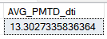

# SQL queries: 

| Metric                             | Query                                                                                                                                                                                                                       | Result                                                                                 |
|------------------------------------|-----------------------------------------------------------------------------------------------------------------------------------------------------------------------------------------------------------------------------|---------------------------------------------------------------------------------------------|
| **Total Loan Applications**        | `SELECT COUNT(id) AS 'Total_Loan_applications' FROM dbo.bank_loan_data;`                                                                                                                                                     |                                   |
| **MTD Loan Applications**          | `SELECT COUNT(id) AS MTD_Loan_Applications FROM dbo.bank_loan_data WHERE Month(issue_date) = (SELECT MONTH(MAX(issue_date)) FROM dbo.bank_loan_data) AND YEAR(issue_date) = (SELECT YEAR(MAX(issue_date)) FROM dbo.bank_loan_data);` |                        |
| **PMTD Loan Applications**         | `SELECT COUNT(id) AS PMTD_Total_Loan_Applications FROM dbo.bank_loan_data WHERE MONTH(issue_date) = (SELECT MONTH(MAX(issue_date)) FROM dbo.bank_loan_data) - 1 AND YEAR(issue_date) = (SELECT YEAR(MAX(issue_date)) FROM dbo.bank_loan_data);` |                      |
| **Total Funded Amount**            | `SELECT SUM(loan_amount) as Total_Funded_Amount FROM dbo.bank_loan_data;`                                                                                                                                                   |                           |
| **MTD Funded Amount**              | `SELECT SUM(loan_amount) AS MTD_Funded_Amount FROM dbo.bank_loan_data WHERE MONTH(issue_date) = (SELECT MONTH(MAX(issue_date)) FROM dbo.bank_loan_data) AND YEAR(issue_date) = (SELECT YEAR(MAX(issue_date)) FROM bank_loan_data);` |                               |
| **PMTD Funded Amount**             | `SELECT SUM(loan_amount) AS PMTD_Funded_Amount FROM dbo.bank_loan_data WHERE MONTH(issue_date) = (SELECT MONTH(MAX(issue_date)) FROM dbo.bank_loan_data) - 1 AND YEAR(issue_date) = (SELECT YEAR(MAX(issue_date)) FROM bank_loan_data);` |                             |
| **Total Amount Received**          | `SELECT SUM(total_payment) as Total_Amount_Received FROM dbo.bank_loan_data;`                                                                                                                                               |                       |
| **MTD Amount Received**            | `SELECT SUM(total_payment) as MTD_Amount FROM dbo.bank_loan_data WHERE MONTH(issue_date) = (SELECT MONTH(MAX(issue_date)) FROM dbo.bank_loan_data) AND YEAR(issue_date) = (SELECT YEAR(MAX(issue_date)) FROM dbo.bank_loan_data);` |                           |
| **PMTD Amount Received**           | `SELECT SUM(total_payment) as PMTD_Amount_Received FROM dbo.bank_loan_data WHERE MONTH(issue_date) = (SELECT MONTH(MAX(issue_date)) FROM dbo.bank_loan_data) - 1 AND YEAR(issue_date) = (SELECT YEAR(MAX(issue_date)) FROM dbo.bank_loan_data);` |                         |
| **AVG Interest Rate**              | `SELECT AVG(int_rate)*100 AS AVG_interest_rate FROM dbo.bank_loan_data;`                                                                                                                                                   |                                         |
| **MTD Avg Interest Rate**          | `SELECT AVG(int_rate)*100 AS AVG_MTD_interest_rate FROM dbo.bank_loan_data WHERE MONTH(issue_date) = (SELECT MONTH(MAX(issue_date)) FROM dbo.bank_loan_data) AND YEAR(issue_date) = (SELECT YEAR(MAX(issue_date)) FROM dbo.bank_loan_data);` |                                 |
| **PMTD Avg Interest Rate**         | `SELECT AVG(int_rate)*100 AS AVG_PMTD_interest_rate FROM dbo.bank_loan_data WHERE MONTH(issue_date) = (SELECT MONTH(MAX(issue_date)) FROM dbo.bank_loan_data) - 1 AND YEAR(issue_date) = (SELECT YEAR(MAX(issue_date)) FROM dbo.bank_loan_data);` |                               |
| **AVG DTI**                         | `SELECT AVG(dti)*100 AS AVG_dti FROM dbo.bank_loan_data;`                                                                                                                                                                |                                                   |
| **MTD DTI**                         | `SELECT AVG(dti)*100 AS AVG_MTD_dti FROM dbo.bank_loan_data WHERE MONTH(issue_date) = 12;`                                                                                                                                 |                                           |
| **PMTD DTI**                        | `SELECT AVG(dti)*100 AS AVG_PMTD_dti FROM dbo.bank_loan_data WHERE MONTH(issue_date) = (SELECT MONTH(MAX(issue_date)) FROM dbo.bank_loan_data) - 1 AND YEAR(issue_date) = (SELECT YEAR(MAX(issue_date)) FROM dbo.bank_loan_data);` |                                                 |
| **Good Loan Percentage**           | `SELECT(COUNT(CASE WHEN loan_status = 'Fully Paid' OR loan_status = 'Current' THEN id END)*100.0)/COUNT(id) AS good_loan_percentage FROM dbo.bank_loan_data;`                                                               |                        |
| **Good Loan Applications**         | `SELECT(COUNT( CASE WHEN loan_status = 'Fully Paid' OR loan_status = 'Current' THEN id END)) AS good_loan_applications FROM dbo.bank_loan_data;`                                                                           |                    |
| **Good Loan Funded Amount**        | `SELECT SUM(loan_amount) AS Good_loan_funded_Amount FROM dbo.bank_loan_data WHERE loan_status IN ('Fully Paid', 'Current');`                                                                                              |                  |
| **Good Loan Amount Received**      | `SELECT SUM(total_payment) AS 'Good_Loan_Amount_Received' FROM dbo.bank_loan_data WHERE loan_status IN ('Fully Paid', 'Current');`                                                                                         |              |
| **Bad Loan Percentage**            | `SELECT (COUNT(CASE WHEN loan_status='Charged Off' THEN id END)*100.0 / COUNT(id)) as 'Bad_Loan_Percentage' FROM dbo.bank_loan_data;`                                                                                      |                          |
| **Bad Loan Applications**          | `SELECT COUNT(id) as 'Bad_Loan_Applications' FROM dbo.bank_loan_data WHERE loan_status='Charged Off';`                                                                                                                  |                      |
| **Bad Loan Funded Amount**         | `SELECT SUM(loan_amount) AS 'Bad_loan_funded_Amount' FROM dbo.bank_loan_data WHERE loan_status='Charged Off';`                                                                                                          |                    |
| **Bad Loan Amount Received**       | `SELECT SUM(total_payment) Bad_Loan_Amount_Received FROM dbo.bank_loan_data WHERE loan_status='Charged Off';`                                                                                                            |                |
| **Loan Status**                     | `SELECT loan_status, COUNT(id) LoanCount, SUM(total_payment) Total_Amount_Received, SUM(loan_amount) Total_funded_Amount, AVG(int_rate)*100 avg_int_rate, AVG(dti)*100 avg_dti FROM dbo.bank_loan_data GROUP BY loan_status;`        |                                       |
| **Loan status**                     | `SELECT loan_status, SUM(total_payment) MTD_Amount_Received, SUM(loan_amount) MTD_funded_amount FROM dbo.bank_loan_data WHERE MONTH(issue_date) = (SELECT MONTH(MAX(issue_date)) FROM dbo.bank_loan_data) AND YEAR(issue_date) = (SELECT YEAR(MAX(issue_date)) FROM dbo.bank_loan_data) GROUP BY loan_status;` |                                       |
| **Month**    | `SELECT MONTH(issue_date) as Month_Number, DATENAME(mm, issue_date) AS Month_Name, COUNT(id) AS total_loan_applications, SUM(loan_amount) AS total_funded_Amount, SUM(total_payment) AS total_amount_received FROM dbo.bank_loan_data GROUP BY MONTH(issue_date), DATENAME(mm,issue_date) ORDER BY MONTH(issue_date);` |                            |
| **STATE**                           | `SELECT address_state AS State, count(id) as total_loan_applications, SUM(loan_amount) as total_funded_amount, SUM(total_payment) as total_amount_received FROM dbo.bank_loan_data GROUP BY address_state ORDER BY address_state;`        |   |
| **Term**                            | `SELECT term as Term, COUNT(id) AS total_loan_applications, SUM(loan_amount) AS total_funded_amount, SUM(total_payment) AS total_amount_received FROM dbo.bank_loan_data GROUP BY term;`                                      |                           |
| **EMPLOYEE LENGTH**                 | `SELECT emp_length AS Employee_Length, COUNT(id) as Total_loan_applications, SUM(loan_amount) AS total_amount_funded, SUM(total_payment) AS total_amount_received FROM dbo.bank_loan_data GROUP BY emp_length ORDER BY emp_length;`    |                            |
| **PURPOSE**                         | `SELECT purpose, COUNT(id) AS total_loan_Applications, SUM(loan_amount) as total_funded_amount, SUM(total_payment) as total_amount_received FROM dbo.bank_loan_data GROUP BY purpose ORDER BY purpose;`                        |                         |
| **Home Ownership**                  | `SELECT home_ownership, COUNT(id) AS total_loan_applications, SUM(loan_amount) as total_funded_amount, SUM(total_payment) as total_amount_received FROM dbo.bank_loan_data GROUP BY home_ownership ORDER BY home_ownership;`     |                    |

